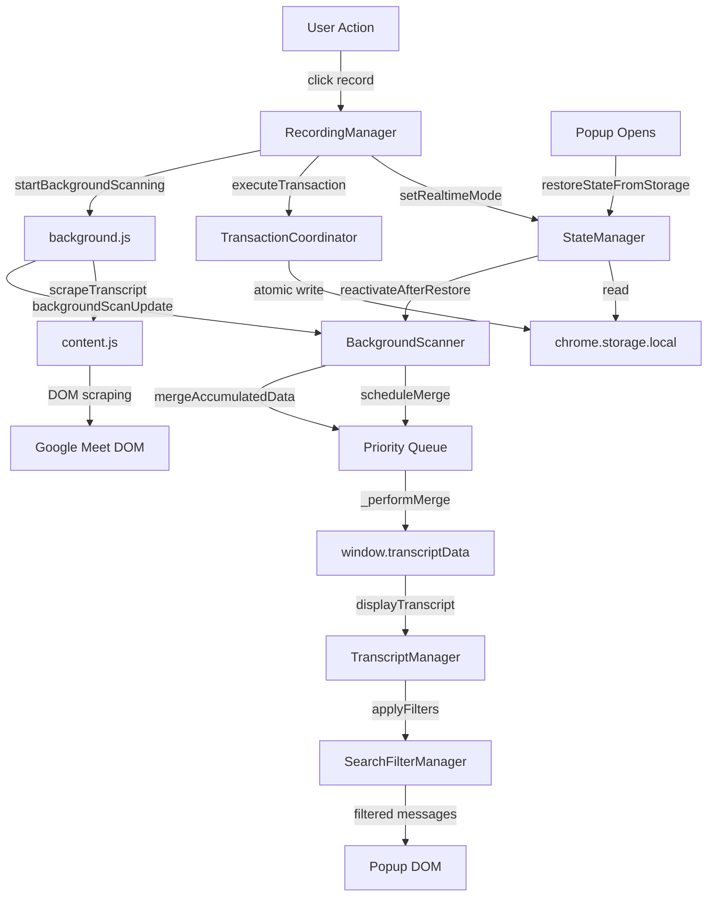

# State Map

## 1. Persisted State (chrome.storage.local)

| Storage Key | ID | Type | Mutated by | Restored by |
|-------------|----|------|------------|-------------|
| transcriptData | S046 | Object | BackgroundScanner (S014), RecordingManager (S013) | StateManager.restoreStateFromStorage (S001) |
| realtimeMode | S050 | boolean | RecordingManager (S013) | StateManager.restoreStateFromStorage (S001) |
| currentSessionId | S048 | string | StateManager (S001), SessionHistoryManager (S015) | StateManager.restoreStateFromStorage (S001) |
| recordingStartTime | — | ISO string | RecordingManager (S013) | StateManager._restoreRecordingStartTime |
| sessionStartTime | — | ISO string | RecordingManager (S013) | StateManager._restoreActiveRecording |
| sessionTotalDuration | — | number (seconds) | TimerManager (S004) | StateManager.restoreStateFromStorage |
| meetTabId | — | number | RecordingManager (S013) | BackgroundScanner.reactivateAfterRestore |
| sessionHistory | S047 | Array | SessionHistoryManager (S015) | SessionHistoryManager.initializeSessionHistory |
| expandedEntries | S049 | Array | TranscriptManager (S017) | StateManager (not currently restored) |
| sessionState | — | enum string | StorageManager.setPausedSessionState, SessionHistoryManager | StateManager.restoreStateFromStorage |
| recordingPaused | — | boolean | StorageManager.setPausedSessionState | StateManager._restorePausedSession |
| recordingStopped | — | boolean | StorageManager.setPausedSessionState | StateManager._restorePausedSession |

## 2. Persisted State (chrome.storage.sync — settings)

| Storage Key | Type | Mutated by | Consumed by |
|-------------|------|------------|-------------|
| userDisplayName | string | SettingsManager (S023) | SettingsManager, content.js |
| googleUserName | string | SettingsManager (S023), GoogleUserDetector (S009) | SettingsManager, content.js |
| promptsList | Array\<Prompt\> | SettingsManager (S023) | SettingsManager (S023), ExportManager (S019) |

## 3. Persisted UI State (chrome.storage.local — lastUIState)

| Key | Type | Mutated by | Restored by |
|-----|------|------------|-------------|
| sidebarCollapsed | boolean | UIManager.toggleSidebar (S003) | UIManager.restoreUIState |
| searchPanelOpen | boolean | SearchFilterManager (S020) | SearchFilterManager.restoreFilterState |
| filterPanelOpen | boolean | SearchFilterManager (S020) | SearchFilterManager.restoreFilterState |
| searchQuery | string | SearchFilterManager (S020) | SearchFilterManager.restoreFilterState |
| activeParticipantFilters | string[] | SearchFilterManager (S020) | SearchFilterManager.restoreFilterState |
| theme | string | UIManager (S003) | UIManager.restoreUIState |

## 4. In-Memory State (window.* globals — popup context only)

| Variable | Type | Initial | Mutated by | Consumed by |
|----------|------|---------|------------|-------------|
| window.transcriptData | Object\|null | null | StateManager, BackgroundScanner, SessionHistoryManager | TranscriptManager, ExportManager, SearchFilterManager |
| window.realtimeMode | boolean | false | RecordingManager | BackgroundScanner, UIManager, SearchFilterManager |
| window.currentSessionId | string\|null | null | StateManager, SessionHistoryManager | RecordingManager, BackgroundScanner, SessionUIManager |
| window.sessionHistory | Array | [] | SessionHistoryManager | SessionUIManager, SettingsManager |
| window.expandedEntries | Set | new Set() | TranscriptManager (via DOMHelpers) | TranscriptManager |
| window.pendingSessionToLoad | string\|null | null | SessionHistoryManager, ModalManager | ModalManager confirmation handlers |

## 5. Module-Internal State

| Module | State Key | Type | Purpose |
|--------|-----------|------|---------|
| BackgroundScanner (S014) | _mergeQueue | Array | Priority queue for merge operations |
| BackgroundScanner (S014) | _isMerging | boolean | Mutex for sequential merge processing |
| BackgroundScanner (S014) | _mergeSequence | number | Unique merge operation ID counter |
| SearchFilterManager (S020) | _currentSearchQuery | string | Active search query |
| SearchFilterManager (S020) | _activeParticipantFilters | Set | Selected participant names |
| SearchFilterManager (S020) | _allParticipants | Array | All detected participant names |
| SearchFilterManager (S020) | _pendingRestoreState | Object\|null | Deferred filter restoration |
| SearchFilterManager (S020) | _hasBeenInitialized | boolean | Prevents auto-select overriding restored filters |
| GoogleUserDetector (S009) | state.lastDetectedName | string\|null | Last detected Google account name |
| GoogleUserDetector (S009) | state.isDetecting | boolean | Continuous detection active flag |
| SettingsManager (S023) | originalUserDisplayName | string | Undo value for cancel button |
| SettingsManager (S023) | prompts | Array | In-memory list of all prompt objects |
| SettingsManager (S023) | _builtinPromptCache | string\|null | Cached built-in prompt.md text |
| SettingsManager (S023) | _editingPromptId | string\|null | ID of prompt being edited in form |
| TransactionCoordinator (S005) | _activeTransactions | Map | In-flight transaction tracking |
| StateManager (S001) | sessionState | Object | recordingStartTime, sessionStartTime, totalDuration, flags |

## State Flow Diagram

