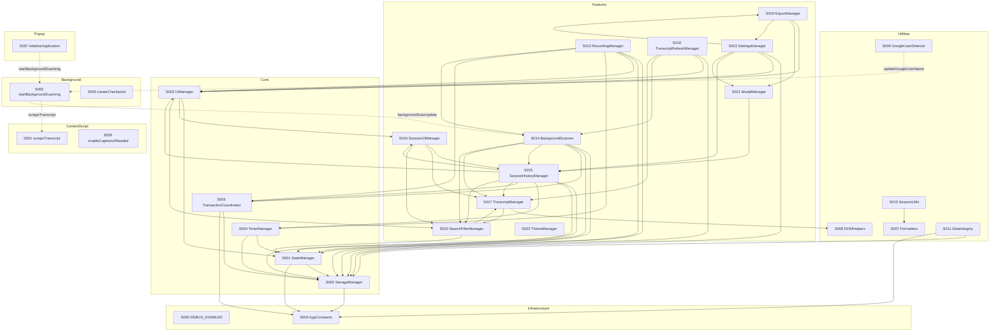

# Knowledge Graph Summary

## Statistics
| Metric | Count |
|--------|------:|
| Total Symbols | 93 |
| -- SRV (Services/Managers) | 18 |
| -- UTL (Utilities) | 67 |
| -- CNS (Constants) | 3 |
| -- STR (State) | 5 |
| Total Relations | 55 |
| -- USES | 55 |
| Circular Dependencies | 2 |
| Business Rules | 55 |
| Chrome Messages | 13 |

## Top 10 Most Connected Symbols
| Rank | Symbol | ID | In | Out | Total | Role |
|------|--------|----|-----|-----|-------|------|
| 1 | SessionHistoryManager | S015 | 4 | 8 | 12 | Core service: session CRUD, auto-save, highest fan-out |
| 2 | StorageManager | S002 | 10 | 1 | 11 | Infrastructure hub: used by nearly every module |
| 3 | UIManager | S003 | 5 | 4 | 9 | UI hub: status, button visibility, sidebar |
| 4 | StateManager | S001 | 6 | 2 | 8 | State hub: central getter/setter pairs |
| 5 | BackgroundScanner | S014 | 2 | 6 | 8 | Data pipeline: merge queue, scan coordination |
| 6 | TranscriptManager | S017 | 5 | 2 | 7 | Display hub: transcript rendering and stats |
| 7 | SearchFilterManager | S020 | 5 | 2 | 7 | Filter hub: search and participant filtering |
| 8 | RecordingManager | S013 | 0 | 6 | 6 | Orchestrator: no inbound deps, drives recording flow |
| 9 | SettingsManager | S023 | 1 | 5 | 6 | Settings service: user preferences, multi-prompt CRUD, Google name |
| 10 | TransactionCoordinator | S005 | 3 | 2 | 5 | Safety layer: atomic writes with rollback |

## Architectural Observations
- **Hub-and-spoke storage pattern**: StorageManager (S002) has the highest in-degree (10) -- nearly every module depends on it for persistence. This is appropriate given its role as the single abstraction over chrome.storage.
- **Leaf orchestrators**: RecordingManager (S013) and SettingsManager (S023) have zero or near-zero in-degree but high out-degree, acting as user-action entry points that orchestrate multiple subsystems.
- **Two runtime-resolved circular dependencies**: S015 <-> S016 (SessionHistoryManager <-> SessionUIManager) and S017 <-> S020 (TranscriptManager <-> SearchFilterManager). Both are resolved via late-binding through `window.*` globals rather than direct imports, so they do not cause load-order issues.
- **Orphan modules**: ThemeManager (S022) and DebugManager (S012) have no inbound or outbound module-level dependencies. ThemeManager operates solely on localStorage and DOM attributes; DebugManager is a development-only introspection tool.
- **High UTL count is inflated by global aliases**: 22 of the 54 UTL symbols (S024-S045) are thin `window.*` delegation aliases, not independent logic. The true utility function count is 32.
- **Three execution contexts with Chrome messaging bridge**: Popup (23 modules), Content Script (1 file + shared detector), and Background Service Worker (1 file). They communicate through 13 Chrome runtime message routes.
- **Strong data integrity layer**: TransactionCoordinator (S005) + DataIntegrity (S011) + checkpoint system (S065-S066) provide crash recovery, orphan detection, and atomic writes -- unusual depth for a browser extension.
- **No external dependencies**: The entire project is vanilla JS with zero npm packages, reducing supply-chain risk but increasing the surface area of hand-rolled utilities.

## Recent Changes (cosmetic, no symbol impact)
- **UI Cleanup (2026-02-14)**: CSS dedup (~150 lines removed from style.css), design token migration in session-history.css, unified trash icons to stroke-based SVG across S016 (SessionUIManager) and S023 (SettingsManager), compacted settings tabs. No new/removed symbols; only innerHTML markup and CSS values changed.

## Index Health Metrics
| Metric | Value | Status |
|--------|-------|--------|
| Last full reindex | 2026-02-14 | OK |
| Source files in repo | 27 | -- |
| Source files indexed | 27 | OK |
| Coverage | 100% | OK |
| Symbols [REMOVED] | 4 | OK |
| Dangling references | 0 | OK |
| Circular dependencies | 2 (runtime-resolved) | WARN |

## Full Graph (Mermaid)

